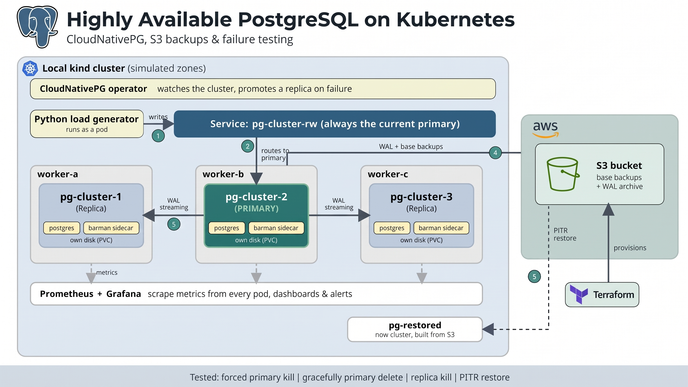

# Highly Available PostgreSQL on Kubernetes

A PostgreSQL platform on Kubernetes using **CloudNativePG**, with automatic failover, S3 WAL archiving and Point-in-Time Recovery (PITR), Prometheus/Grafana monitoring, and measured failure experiments.

The goal is not just to deploy PostgreSQL on Kubernetes, but to **break it on purpose and measure what happens**: how long writes are interrupted, and whether any acknowledged write is lost.

## Architecture



* **3 PostgreSQL instances** (1 primary + 2 replicas) managed by CloudNativePG
* Streaming replication (**asynchronous**) with automatic failover
* One persistent volume per instance
* Topology spread constraints across worker nodes
* AWS S3 for base backups and WAL archiving (Barman Cloud plugin), provisioned with Terraform
* Prometheus, Grafana and PrometheusRule alerts
* Python load generator and bash runner for failure experiments

> The environment is a local **kind** cluster. The `zone-a/b/c` labels are simulated: they are not real availability zones. The only real cloud component is the S3 bucket.

## Technologies

| Technology | Purpose |
|---|---|
| Kubernetes (kind) | Local multi-node cluster |
| CloudNativePG | PostgreSQL HA and lifecycle management |
| PostgreSQL 18 | Database |
| AWS S3 + Terraform | Backup and WAL storage, provisioned as code |
| Barman Cloud plugin, cert-manager | Backup and WAL archiving |
| Prometheus, Grafana | Metrics, dashboard, alerts |
| Python, Bash | Load generator and experiment runner |

## How failover is exposed

Applications connect to the `pg-cluster-rw` service, which always points to the current primary, instead of connecting to a pod. When the primary fails, the operator promotes the most up-to-date replica and the service follows.

## Measurement method

A Python writer runs inside the cluster and inserts rows with an incrementing ID through `pg-cluster-rw`. It logs every attempt (start, end, success or error). Short client timeouts (about 3 s) make dead connections fail quickly.

After each run, a verifier compares the IDs the database **acknowledged** with the IDs actually in the table:

| Output | Meaning |
|---|---|
| `max write gap` | Longest period without a successful write (write interruption, RTO as seen by the application) |
| `LOST (acked, absent)` | Rows the database confirmed and then lost (RPO) |
| `failed requests` | Attempts that returned an error or timed out. Not data loss. |

A run is only valid if the primary actually changed (forced and graceful kills) or stayed the same (replica kill). Each experiment was run 5 times. The experiment runner also records a one-second timeline of the cluster phase and current primary.

## Failure test results

All tests use **asynchronous replication**.

### Forced primary kill (`--grace-period=0 --force`, n=5)

| Metric | Result |
|---|---|
| Write interruption | median **19.9 s** (range 19.8 to 20.9 s) |
| Failed requests per run | 26 to 27 |
| Acknowledged writes lost | **0** in all 5 runs |
| New primary visible | about 21 to 23 s after the kill |
| Cluster back to "healthy" | about 32 to 33 s after the kill |

The operator reacts within about 1 s ("Failing over"), but the new primary appears only after about 22 s. The cause of this delay was not investigated. Part of the measured gap (about 3 s) is the load generator's own timeout.

An earlier batch of the same experiment contained one 39.5 s outlier, during which the VM was visibly slow (low throughput, high latency for the whole run). It is excluded from the table above.

### Replica kill (n=5)

| Metric | Result |
|---|---|
| Primary failovers | 0 |
| Failed requests | 0 |
| Acknowledged writes lost | 0 |
| Write gap | at most 0.07 s (same as the no-failure baseline) |
| Cluster back to "healthy" | about 13 to 14 s |

### Graceful primary deletion (n=5): inconclusive

The writer saw **0 failed requests and a gap of about 0.05 s**, yet the cluster reported "Failing over" and the new primary appeared about 70 s after the delete. This probably reflects the load generator's single long-lived connection (the old primary seems to have kept serving it during its shutdown) rather than a true zero-downtime failover. **This was not verified**, so these runs are not comparable to the forced-kill downtime and should not be read as "no downtime".

### Caveats

* 0 lost writes in 5 runs does **not** prove asynchronous replication cannot lose data. At a low write rate the window is small. Synchronous replication was not tested.
* Baseline (no failure): 0 failed, 0 lost, 0.05 s max gap, p50/p99 write latency about 0.6 / 9 ms.
* Results come from a single local VM and are laboratory measurements, not production benchmarks.

## Backup and Point-in-Time Recovery

Replication copies mistakes to every replica, so it does not protect against accidental deletion. The project adds:

* Base backups and continuous WAL archiving to S3
* A scheduled daily base backup
* PITR into a **new** cluster (a running Postgres cannot be rewound)

### PITR test

1. Take a base backup.
2. Create a table with 1000 rows (after the backup, so the rows exist only in the WAL).
3. Record a UTC timestamp, then `DELETE` all rows. Replicas also show 0 rows.
4. Force the last WAL segment to S3 (`pg_switch_wal()`).
5. Create a new cluster recovering from S3 to the recorded timestamp.

| Metric | Result |
|---|---|
| Recovered rows | 1000 / 1000 (original cluster still at 0) |
| Recovery time | about 105 s (1 instance, very small database) |

Restore time grows with database size and the amount of WAL to replay.

## Monitoring and alerting

The Grafana dashboard (`monitoring/dashboard.json`) shows: instances ready, replication lag, WAL archive failures, transactions per second, connections, seconds since last WAL archive, and replica WAL receiver status.

Configured alerts (`monitoring/alerts/`): collector down, replica not streaming, high replication lag, WAL archive failures, WAL archiving stalled, collector errors, high connection wait count, high rollback rate.

Note: "seconds since last archive" grows on an idle database, because no WAL is produced. An alert on it needs to account for idle periods.

## Not tested

Node drain, zone loss, network partition, disk full, and synchronous replication were **not tested**. No SLO or error-budget analysis was done.

## Limitations

* Local kind cluster: nodes are containers on one machine, not independent hardware.
* Topology zones are simulated.
* Storage is node-local, so a lost node means a lost volume. Real recovery in that case relies on replicas and S3 backups.
* S3 access uses static IAM credentials stored in a Kubernetes Secret. On EKS, IRSA or Pod Identity with a least-privilege role would be the right choice.

## Project structure

```text
pg-ha-k8s/
├── cluster/          kind config, CloudNativePG Cluster manifests
├── backup/           ObjectStore, Backup, ScheduledBackup, restore manifests
├── monitoring/       dashboard.json, alerts/
├── loadgen/          Python writer and verifier
├── chaos/            run.sh experiment runner
├── terraform-s3/     S3 bucket (Terraform)
├── docs/             architecture diagram, results
└── README.md
```

## Deployment

Prerequisites: Docker, kind, kubectl, Helm, Terraform, AWS CLI, an AWS account.

The order matters.

```bash
# 1. Cluster
kind create cluster --name pg-lab --config cluster/kind-config.yaml

# 2. CloudNativePG operator
helm repo add cnpg https://cloudnative-pg.github.io/charts
helm upgrade --install cnpg cnpg/cloudnative-pg -n cnpg-system --create-namespace

# 3. Monitoring stack
helm repo add prometheus-community https://prometheus-community.github.io/helm-charts
helm upgrade --install monitoring prometheus-community/kube-prometheus-stack \
  -n monitoring --create-namespace \
  --set prometheus.prometheusSpec.podMonitorSelectorNilUsesHelmValues=false \
  --set prometheus.prometheusSpec.serviceMonitorSelectorNilUsesHelmValues=false \
  --set prometheus.prometheusSpec.ruleSelectorNilUsesHelmValues=false

# 4. S3 bucket
cd terraform-s3 && terraform init && terraform apply && cd ..

# 5. cert-manager and the Barman Cloud plugin (use the latest release of each)
kubectl apply -f https://github.com/cert-manager/cert-manager/releases/download/<version>/cert-manager.yaml
kubectl apply -f https://github.com/cloudnative-pg/plugin-barman-cloud/releases/download/<version>/manifest.yaml

# 6. S3 credentials as a Secret (never commit this)
kubectl create secret generic aws-s3-creds \
  --from-literal=ACCESS_KEY_ID=<key> --from-literal=ACCESS_SECRET_KEY=<secret>

# 7. ObjectStore FIRST, then the Cluster that references it
kubectl apply -f backup/objectstore.yaml
kubectl apply -f cluster/cnpg-cluster-async.yaml

# 8. Monitoring objects, then experiments
kubectl apply -f monitoring/
./chaos/run.sh force-1 primary-force
```

Create the `ObjectStore` before adding the `plugins:` block to the Cluster. If the Cluster is applied first, the plugin stops reconciliation and the operator does not retry on its own; re-trigger it with `kubectl annotate cluster pg-cluster nudge=$(date +%s) --overwrite`.

Clean up AWS resources when finished: `cd terraform-s3 && terraform destroy`.

## What this project demonstrates

* Stateful workloads on Kubernetes and why a plain StatefulSet is not enough for a database
* The operator pattern (CloudNativePG) for replication, failover and backups
* Replication versus backups: availability versus protection against human error
* Measuring RTO and RPO with an acknowledged-write checker, and reporting results honestly (median, range, outliers, unverified findings)
* WAL archiving and PITR to S3, with infrastructure provisioned by Terraform